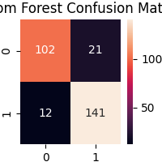
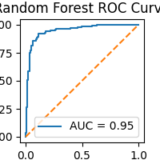

1. PROJECT OVERVIEW :
The project focuses on predicting heart disease using machine learning classification algorithms based on various medical parameters.

2.DATASET
source : The dataset have taken from the kaggle.
Rows   : The data set contains around 918 observations and 11 features.
    1. Age: age of the patient [years]
    2. Sex: sex of the patient [M: Male, F: Female]
    3. ChestPainType: chest pain type [TA: Typical Angina, ATA: Atypical Angina, NAP: Non-Anginal Pain, ASY: Asymptomatic]
    4. RestingBP: resting blood pressure [mm Hg]
    5. Cholesterol: serum cholesterol [mm/dl]
    6. FastingBS: fasting blood sugar [1: if FastingBS > 120 mg/dl, 0: otherwise]
    7. RestingECG: resting electrocardiogram results [Normal: Normal, ST: having ST-T wave abnormality (T wave inversions and/or ST elevation or depression of > 0.05 mV), LVH: showing probable or definite left ventricular hypertrophy by Estes' criteria]
    8. MaxHR: maximum heart rate achieved [Numeric value between 60 and 202]
    9. ExerciseAngina: exercise-induced angina [Y: Yes, N: No]
    10. Oldpeak: oldpeak = ST [Numeric value measured in depression]
    11. ST_Slope: the slope of the peak exercise ST segment [Up: upsloping, Flat: flat, Down: downsloping]
    12. HeartDisease: output class [1: heart disease, 0: Normal]

Project_Type : This is a classical basic ML project - using a Classification model to predict the heart disease.

3.WORKFLOW
 -Data Preprocessing
 -EDA
 -Standardization
 -Model Building
 -Model Evaluation
 -Model Saving
 -Model Deployment

4.TECHNOLOGIES USED
- Python
- Pandas
- NumPy
- Matplotlib
- Seaborn
- Scikit-Learn
- Logistic Regression
- Random Forest
- XGBoost
- Jupyter Notebook
 

5. MODEL USED 
  -Logistic Regression
  -Random Forest
  -XGBoost 

6. METRICS
 -Accuracy Score
 -Confusion Matrix
 -Classification Report
 -ROC Curve
 -AUC Score

7. BEST MODEL
After comparing Logistic Regression, Random Forest, and XGBoost using Accuracy, Recall, and ROC-AUC metrics, 
Random Forest was selected as the final model due to its strong recall score and best ROC-AUC performance. 

8. IMAGES
    -Confusion Matrix =  
    -ROC Curve =    

9.MODEL COMPARISON

Model                 Accuracy    Recall    ROC-AUC 
Logistic Regression  	0.88	   0.92	    0.93
Random Forest	        0.88	   0.92	    0.95
XGBoost	                0.89	   0.91	    0.94

9. FUTURE SCOPE 
 -Perform advanced feature engineering
 -Train the model on larger healthcare datasets
 -Add deep learning models for comparison
 -Integrate the model with cloud deployment services

